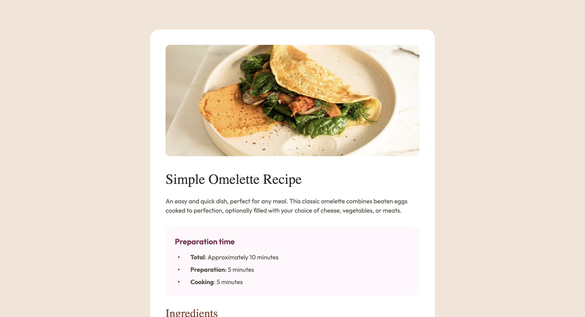

## Overview


This project is a solution to the [Frontend Mentor Recipe Page challenge](https://www.frontendmentor.io/challenges/recipe-page-Y1W76gkW). The goal of this challenge is to build a recipe page that is both functional and responsive. The page is built using **Tailwind CSS**, a utility-first CSS framework, to create a clean, mobile-first design.

## Features

- **Responsive Design**: The layout is fully responsive, adjusting to mobile and desktop screens.
- **Tailwind CSS**: Utilized Tailwind CSS for styling, allowing for a fast and efficient development process.
- **Custom Fonts**: Incorporated custom fonts as specified in the design guide.
- **Semantic HTML**: Ensured accessibility and readability with well-structured HTML.
  
## Tools and Technologies Used

- **HTML5**
- **Tailwind CSS** (for styling)
- **VSCode** (or any code editor of your choice)
- **Git** (for version control)
- **GitHub** (for hosting the project)

## How to Run the Project Locally

1. Clone the repository to your local machine:
   ```bash
   git clone https://github.com/Jigs1612/Recipe
   ```

2. Navigate to the project folder:
   ```bash
   cd recipe
   ```

3. Open `index.html` in your preferred browser.

## What I Learned

- How to build a fully responsive layout using **Tailwind CSS**.
- The importance of mobile-first design and testing across different screen sizes.
- How to structure semantic HTML for better accessibility and SEO.

## Challenges

- Making the page fully responsive across different screen sizes.
- Working with static JPG design files and making decisions for font sizes, margins, and other design details.

## Future Improvements

- Adding interactive JavaScript functionality, such as a search filter or toggle for ingredient details.
- Implementing animations or transitions to enhance the user experience.
- Improving accessibility by adding ARIA roles and other accessibility features.

## Repository

You can find the source code for this project on [GitHub](https://github.com/Jigs1612/Recipe).
